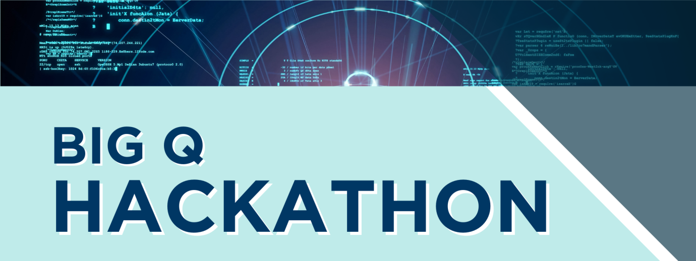

# CQE Big Q Hack 2023 - Team GateHackers

## Team Information 
- Quantum Computing Platform Provider - Quantinuum (Mentored by Dr.Kathrin Spendier)
- Quantum Computing Use Case Provider - General Atomics (Dr. Matthew Cha & Dr.Pejman J.)
- Team Members : Ariadna Fernandez, Atharva Vidwans, Dhanvi Bharadwaj, Guillaume Remy and Preetham Tikkireddi

## Introduction
The collision processes and scattering physics of particles, atoms and molecules are crucial to our
understanding of the fundamental structure of matter. Fusion is the quantum nuclear reaction that
occurs when two light nuclei collide and fuse to create a single heavier nucleus with less mass than
the two original nuclei. The leftover mass is converted to energy and is responsible for the
generation of fusion energy. Harnessing practical fusion energy is identified as one of the Grand
Challenges for Engineering in the 21st Century.
Current fusion devices focus on deuterium-tritium (D-T) reaction [Kikuchi10], with two branches:
D + T → 5He∗
 → 4He(3.5 MeV) + n(14.1 MeV),
D +T → 5He∗
 → 5He+γ(16.75 MeV).
The fusion power gain in a large fusion device such as the International Thermonuclear
Experimental Reactor (ITER) or a Fusion Pilot Plant (FPP) is gauged by measuring neutron
production. However, the γ to n branching ratio is very small, somewhere between 1×10−5 and
3×10−4 with an uncertainty of about 50% [Kim12].
Ab initio approaches, such as the no-core shell model with continuum (NCSMC), represents the state
of the art for modeling D-T fusion [Hupin19]. To accurately model reactions, and in particular to
get the correct absolute values, the NCSMC includes as many scattering and reaction channels as
possible. Thus, not only is the relative motion of deuterium and tritium included, but also virtual
excited states as well, requiring a fully five-body quantum-mechanical wave function.
Numerical simulation could serve to guide and accelerate the time to experimental discovery in
quantum scattering. However, all known methods for classical simulation of fusion reaction, such as
renormalization group, quantum Monte Carlo, and tensor network methods, suffer from issues of
scalability, accuracy, and efficiency for quantum many-body systems, and introduce errors that are
difficult to gauge. Thus, the fusion reaction problem is an ideal candidate for demonstrating early
quantum advantage.
Quantum Algorithms
Quantum computation has the potential for the efficient simulation of many body quantum systems.
This was demonstrated in polynomial time quantum algorithms, usually based on quantum phase
estimation (QPE), to solve the ground state and low-energy excited states for certain families of
quantum Hamiltonians with provable guarantees [Abrams99, Aspuru-Guzik05]. However, the QPE
algorithm requires resources that are out of reach for near term quantum hardware and it is
unclear when it will be achievable at scale. A variety of quantum algorithms for solving the ground
state problem on near-term noisy and early fault-tolerant quantum hardware have been proposed,
notably including the quantum metropolis algorithm, variational quantum eigensolver [Peruzzo14],
and quantum imaginary time evolution (QITE) [Jouzdani22]. Below, we highlight recent
demonstrations of quantum algorithms for the simulation of many body quantum Hamiltonians
towards quantum scattering:
 Scattering in the Ising model with the Quantum Lanczos Algorithm [Yeter21].
 Simulating excited states of the Lipkin model on a quantum computer [Manqoba23].
 Nuclear shell-model simulation in digital quantum computers [Perez23].
Use Case Study
As a step towards applying quantum algorithms for the simulation of fusion reaction, we propose
the case study of quantum simulation of scattering of low-energy states in a model many body
quantum Hamiltonian. Such a study was performed for the Ising model on a 5-qubit IBM quantum
computer [Yeter21].
In this study, participants will first select a model quantum many body Hamiltonian. For example,
 the Lipkin model [Manqoba23],
 a simple nuclear Hamiltonian for proton-neutron interaction [Jouzdani22],
 the anisotropic 1-D XXZ-Heisenberg [VanDyke21].
Next, participants will demonstrate scattering of low-energy states. For example, in the 1-D
Heisenberg model in the ferromagnetic phase, low-energy excitations of an all up spin ground state
have blocks of down spins of down spins on neighboring sites and are called magnon bound states.
Scattering of magnon bound states have been shown to produce soliton-like behavior and have
been studied classically using DMRG and Bethe ansatz methods. Participants will use quantum
algorithms to determine physical quantities, such as scattering amplitudes, scattering phase, and
block length displacements, that describe the outcomes of scattering processes [Francis20]. For
example, a scattering amplitude, or transition probability, between an initial and final state may be
computed by
𝐴(𝑡) = 〈𝜓௙௜௡|𝜓௜௡(𝑡)〉 where |𝜓(𝑡)⟩ = 𝑒
ି௜ு௧|𝜓⟩
Various methods can be used when performing scattering calculations such as a Green’s function
approach through the Schwinger-Lipmann equation [Baker21] or dynamic approach with timeevolved two-point correlation functions [Yeter21].
## References
[Abrams99] D. S. Abrams and S. Lloyd. Quantum algorithm providing exponential speed
increase for finding eigenvalues and eigenvectors. Physical Review Letters
83(24), 5162 (1999)
[Aspuru-Guzik05] A. Aspuru-Guzik, A. D. Dutoi, P. J. Love, and M. Head-Gordon. Simulated
quantum computation of molecular energies. Science 309(5741), 1704–1707
(2005)
[Baker21] T. E. Baker. Lanczos recursion on a quantum computer for the green’s
function and ground state. Physical Review A 103(3), 032404 (2021)
[Hupin19] G. Hupin, S. Quaglioni, and P. Navrátil. Ab initio predictions for polarized
deuterium- tritium thermonuclear fusion. Nature communications 10(1), 1–8
(2019)
[Francis20] A. Francis, J. K. Freericks, and A. F. Kemper. Quantum computation of magnon
spectra. Phys. Rev. B 101, 014411 (2020)
[Jouzdani22] P. Jouzdani, C. W. Johnson, E. R. Mucciolo, and I. Stetcu. Alternative approach
to quantum imaginary time evolution. Phys. Rev. A 106, 062435 (2022)
[Kikuchi10] M. Kikuchi, A Review of Fusion and Tokamak Research Towards Steady-State
Operation: A JAEA Contribution. Energies 3, no. 11: 1741-1789 (2010)
[Kim12] Y. Kim, J. Mack, H. Herrmann, C. Young, G. Hale, S. Caldwell, N. Hoffman, S.
Evans, T. Sedillo, A. McEvoy et al. Determination of the deuterium-tritium
branching ratio based on inertial confinement fusion implosions. Physical
Review C 85(6), 061601 (2012)
[Manqoba23] M. Q. Hlatshwayo, Y. Zhang, H. Wibowo, R. LaRose, D. Lacroix, and E.
Litvinova. Simulating excited states of the Lipkin model on a quantum
computer. Phys. Rev. C 106, 024319 (2023)
[Perez23] A. Pérez-Obiol, A. M. Romero, J. Menéndez, A. Rios, A. García-Sáez, and B.
Juliá-Díaz. Nuclear shell-model simulation in digital quantum computers. Sci
Rep 13, 12291 (2023).
[Peruzzo14] A. Peruzzo, J. McClean, P. Shadbolt, M.-H. Yung, X.-Q. Zhou, P. J. Love, A.
Aspuru- Guzik, and J. L. O’brien. A variational eigenvalue solver on a
photonic quantum processor. Nature communications 5(1), 1–7 (2014)
[VanDyke21] J. S. Van Dyke, E. Barnes, S. E. Economou, and R. I. Nepomechie. Preparing
exact eigenstates of the open XXZ chain on a quantum computer. Phys. A:
Math. Theor. 55 055301 (2021)
[Yeter21] K. Yeter-Aydeniz, G. Siopsis, and R. C. Pooser. Scattering in the Ising model
with the quantum lanczos algorithm. New Journal of Physics 23(4), 043033
(2021)